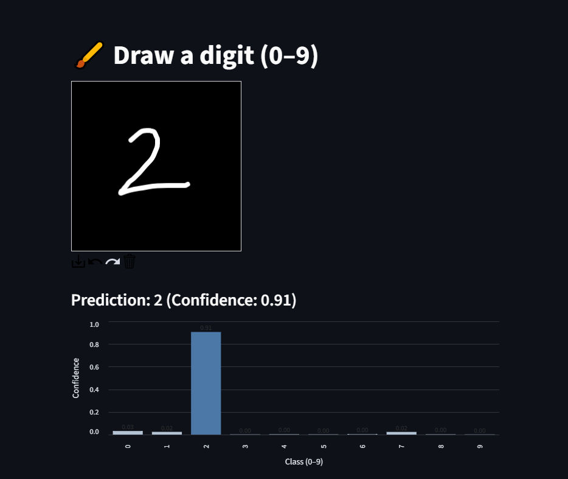

# Handwritten Digit Recognition — PyTorch + Streamlit

A compact deep‑learning project for **handwritten digit (0–9) recognition** built with **PyTorch** and served via a simple **Streamlit** UI. The app lets you draw a digit in the browser and see the model’s prediction and class confidence scores.

> **Used Technologies:** PyTorch, torchvision, Streamlit, Pillow, NumPy

---

## Demo




---

## Project Structure

```
.
.
├── ui/
│   ├── gui.py          # Streamlit app (draw, preview, predict)
│   ├── processor.py    # Preprocessing utilities (resize, normalize, COM align, max-filter)
│   └── predictor.py    # Model load + inference utilities
├── helper_functions.py # Extra utility functions (metrics, plots, etc.)  downloaded in Pytorch tools
├── model_digit.py      # Model definition used during training
├── model_digit.pth     # Trained weights file 
├── requirements.txt    # Python dependencies
└── README.md

```

---


### 1) Create environment & install deps

```bash
python -m venv .venv
# Windows
.venv\Scripts\activate
# macOS/Linux
source .venv/bin/activate

pip install -r requirements.txt
```

### 2) Put your model file

Place your trained weights at:

```
./model_digit.pth
```
 This file is generated after training in digit_recognize.ipynb.
 
### 3) Run the GUI

```bash
streamlit run ui/gui.py
```

Open the local URL that Streamlit prints (`http://localhost:8501`).

---

##  How It Works

### Preprocessing (`processor.py`)

The UI passes the drawn image to `preprocess()` which typically:

1. Converts to **grayscale** and **inverts** if needed (white digit on black background for MNIST conventions).
2. **Crops** to the bounding box of the stroke (optional padding retained).
3. **Resizes** to **28×28** pixels.
4. **Center‑of‑mass alignment**: recenters the digit to reduce positional bias.
5. **Max‑filter**: denoises thin strokes and gaps.
6. Converts to **tensor** `[1, 28, 28]` and **normalizes** with **mean=0.1307, std=0.3081** to match MNIST training.

> Keeping preprocessing identical between training and inference is crucial for high probabilities.

### Inference (`predictor.py`)

* Loads the PyTorch model (e.g., `MNISTModel` from `model_digit.py`).
* Applies `softmax` to obtain probabilities.
* Returns **top‑k** predictions for display in the UI.

---

##  Training the Model

The model was trained on the **MNIST dataset** (handwritten digits 0–9).

- **Transforms**: 
  - `ToTensor()`
  - `Normalize((0.1307,), (0.3081,))`  
- **Architecture**: A small CNN with 2 convolutional layers + ReLU + MaxPooling, followed by fully connected layers.  
- **Loss**: `CrossEntropyLoss`  
- **Optimizer**: `Adam(lr=0.01)`  
- **Epochs**: 20  

Training was done in `digit_recognize.ipynb`. After training, the weights were saved as:  

- **Training accuracy**: ~99%  
- **Test accuracy**: ~98%  

---


##  Example (Demo) Output

Prediction: 2

| Digit | Probability |
|-------|-------------|
| 2     | **0.91**   |
| 0     | 0.006       |
| 7     | 0.004       |
| 1    | 0.002       |


---

## License

This project is licensed under the [MIT License](LICENSE).
---


